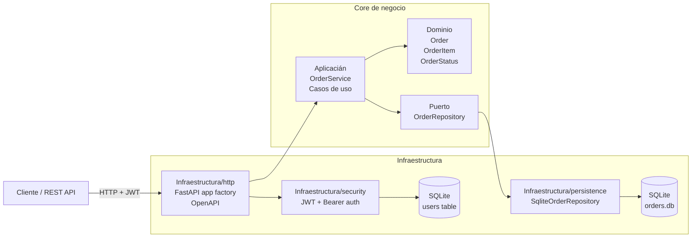

# Orders Service

Servicio de orders con arquitectura hexagonal, API FastAPI y autenticación JWT.

## Visión general

Este proyecto implementa un servicio de pedidos con separación clara de responsabilidades:

- Dominio: entidades, reglas del negocio y validaciones.
- Aplicación: casos de uso y orquestación de la lógica.
- Puertos: contrato del repositorio.
- Infraestructura: FastAPI, JWT, SQLite y migraciones.

## Arquitectura



### Capas del proyecto

- Capa de dominio
  - `src/proyecto_final/domain/order.py`
  - `Order`, `OrderItem`, `OrderStatus`
  - reglas de negocio como validación de items, total y transiciones de estado

- Capa de aplicación
  - `src/proyecto_final/application/use_cases.py`
  - `OrderService`
  - creación, listado, detalle y actualización de estado

- Capa de infraestructura
  - `src/proyecto_final/infrastructure/http`: app factory, rutas y schemas
  - `src/proyecto_final/infrastructure/security`: JWT y autenticación
  - `src/proyecto_final/infrastructure/persistence`: repositorio SQLite
  - `migrations/`: Alembic para migraciones

## Funcionalidades

- Crear Órdenes con uno o varios items.
- Validar totales y transiciones de estado.
- Consultar orden por id y listar todas las órdenes.
- Actualizar estado de la orden dentro de reglas permitidas.
- Autenticación con JWT en endpoints protegidos.
- Documentación automática con OpenAPI/Swagger.
- Persistencia con SQLite.
- Pruebas de caso de uso, API, contrato y E2E.

## Requisitos

- Python 3.12+
- Poetry
- SQLite

## Inicio del proyecto

```bash
poetry install
```

Configuración recomendada de entorno:

```bash
set JWT_SECRET=orders-service-jwt-secret-key-32chars
set ORDER_DB_PATH=C:\proyectos\Python\Poryecto_Final2\Proyecto_Final\orders.db
```

Aplicar migraciones:

```bash
poetry run alembic upgrade head
```

Levantar la aplicación:

```bash
poetry run uvicorn proyecto_final.main:app --reload
```

La API queda disponible en:

- http://localhost:8000/docs
- http://localhost:8000/redoc

## Autenticación

Credenciales demo:

```json
{
  "username": "admin",
  "password": "admin123"
}
```

Login:

```bash
curl -X POST http://localhost:8000/auth/login   -H "Content-Type: application/json"   -d '{"username":"admin","password":"admin123"}'
```

Respuesta ejemplo:

```json
{
  "access_token": "<jwt>",
  "token_type": "bearer"
}
```

Uso del token:

```bash
curl -H "Authorization: Bearer <jwt>" http://localhost:8000/orders
```

## Endpoints principales

- `POST /auth/login`
- `POST /orders`
- `GET /orders`
- `GET /orders/{order_id}`
- `PATCH /orders/{order_id}/status`

## Migraciones Alembic

Generar una nueva migración:

```bash
poetry run alembic revision --autogenerate -m "descripcion"
```

Aplicar migraciones:

```bash
poetry run alembic upgrade head
```

## Pruebas

Ejecutar la suite completa:

```bash
poetry run pytest
```

Pruebas disponibles:

- `tests/test_use_cases.py`: casos de uso y validación de dominio.
- `tests/test_api.py`: flujo HTTP autenticado.
- `tests/test_contract.py`: verificación del contrato OpenAPI.
- `tests/test_e2e.py`: integración con migraciones y flujo completo.

## Calidad

```bash
poetry run ruff check src tests
poetry run mypy src
poetry run pytest
```

## Docker

Construir imagen:

```bash
docker build -t orders-service .
```

Ejecutar contenedor:

```bash
docker run -p 8000:8000 -e JWT_SECRET=orders-service-jwt-secret-key-32chars orders-service
```

## CI/CD

El proyecto incluye una pipeline de GitHub Actions en `.github/workflows/ci.yml` con:

- lint con Ruff
- tipado con mypy
- pruebas con pytest
- build de la imagen Docker

## Estructura principal

```text
src/
  proyecto_final/
    application/
    domain/
    infrastructure/
    main.py
migrations/
  versions/
 tests/
 .github/workflows/
 Dockerfile
 alembic.ini
 pyproject.toml
 README.md
```
