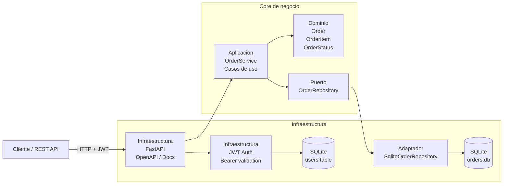

# Orders Service

Servicio de Orders implementado con arquitectura hexagonal:

- **Dominio**: entidades y reglas de negocio.
- **Casos de uso**: creación, consulta, listado y transición de estado.
- **Puertos**: contrato `OrderRepository`.
- **Adaptadores**: SQLite para persistencia y API FastAPI.
- **Autenticación**: login con JWT para proteger endpoints.

## Arquitectura



### Capas de la arquitectura

- Capa de infraestructura:
  - FastAPI para HTTP y OpenAPI
  - JWT para autenticación
  - SQLite y Alembic para persistencia y migraciones
  - Docker y CI/CD para delivery
- Capa de aplicación:
  - `OrderService`
  - validación de reglas de negocio y transiciones de estado
- Capa de dominio:
  - `Order`, `OrderItem`, `OrderStatus`
  - invariantes del negocio
- Capa de adaptadores/puertos:
  - `OrderRepository`
  - implementación concreta `SqliteOrderRepository`

## Seguridad y documentación

- Persistencia real con SQLite.
- Autenticación mediante JWT Bearer Token.
- Endpoint de login: `POST /auth/login`
- Documentación OpenAPI en:
  - `/docs` (Swagger UI)
  - `/redoc`

## Ejecutar local

```bash
poetry install
set JWT_SECRET=orders-service-jwt-secret-key-32chars
set ORDER_DB_PATH=C:\proyectos\Python\Poryecto_Final2\Proyecto_Final\orders.db
poetry run alembic upgrade head
poetry run uvicorn proyecto_final.main:app --reload
```

Credenciales demo:

```json
{
  "username": "admin",
  "password": "admin123"
}
```

## Obtener token JWT

```bash
curl -X POST http://localhost:8000/auth/login -H "Content-Type: application/json" -d '{"username":"admin","password":"admin123"}'
```

Luego usa el token en el header:

```bash
curl -H "Authorization: Bearer <token>" http://localhost:8000/orders
```

La base de datos SQLite se guarda en `orders.db` por defecto, o en la ruta indicada por `ORDER_DB_PATH`.

## Migraciones Alembic

```bash
poetry run alembic upgrade head
poetry run alembic revision --autogenerate -m "descripcion"
```

## Calidad

```bash
poetry run ruff check .
poetry run mypy src
poetry run pytest
```

## Docker

```bash
docker build -t orders-service .
docker run -p 8000:8000 -e JWT_SECRET=orders-service-jwt-secret-key-32chars orders-service
```

## CI/CD

Incluye pipeline de GitHub Actions en `.github/workflows/ci.yml` con:
- lint (`ruff`)
- tipado (`mypy`)
- pruebas (`pytest`)
- build de imagen Docker
